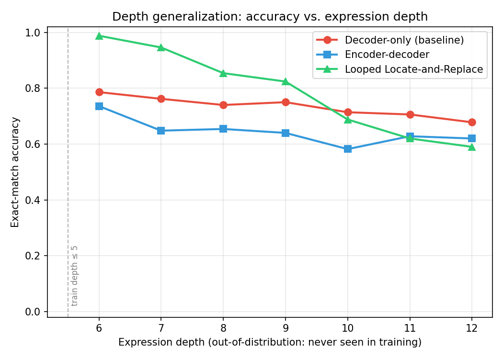

# proyecto_llm_mini

Mini-LLM construido desde cero, en dos fases, como proyecto de portfolio.

## Fase A — Mini-LLM de propósito general

Un modelo de lenguaje decoder-only con arquitectura moderna (RoPE, RMSNorm, SwiGLU,
Grouped Query Attention), entrenado sobre texto real (WikiText-103). ~26M parámetros,
tokenizer BPE propio.

```bash
pip install -r requirements.txt

# 1. Descargar WikiText-103, entrenar el tokenizer BPE y binarizar los tokens
python -m mini_llm.data.prepare_data --dataset wikitext-103-raw-v1 --vocab-size 8192

# 2. Entrenar
python -m mini_llm.train.train --max-steps 20000 --batch-size 32

# 3. Generar texto
python -m mini_llm.inference.generate --prompt "The history of" --max-new-tokens 200
```

**Resultado**: 26.4M parámetros, entrenado 20.000 pasos (~3.3 épocas sobre 139M tokens)
en ~1.6h en una RTX 4060, `val_loss` final ≈ 2.95 (perplejidad ≈ 19). Ejemplo de
generación (`--prompt "In 1943, the"`):

> In 1943, the US and Germany would not be part of the new German states .
> = = = Final days = = =
> Following the death of Obersturm in July 1943 , the government decided to transfer
> the remainder of the Army and the military to the United States. [...]

El modelo aprendió gramática, puntuación, y hasta convenciones propias del formato
WikiText (como `@-@` para guiones) sin que se le indicara explícitamente.

### Coconut — TUI de agente (estilo Claude Code)

```bash
python coconut.py
```

Interfaz de terminal construida con [Textual](https://textual.textualize.io/): panel
de conversación (streaming token a token, Markdown vía Rich) + panel de actividad
con eventos plegables (`⏺ Leyendo README.md` → `✓`), diffs coloreados, indicador de
"trabajando" e input inferior — igual que Claude Code, pero para nuestro propio modelo.

Como Coconut es un **base model sin fine-tuning de instrucciones**, la propia UI lo
deja claro y sugiere prompts que sí funcionan (continuaciones de prosa, no preguntas).

Comandos disponibles:
- `/read <ruta>` — lee un fichero real del repo (con resaltado)
- `/test [ruta]` — ejecuta pytest de verdad y muestra el resultado
- `/diff <ruta>` — muestra el `git diff` real de un fichero, coloreado
- `/temp <valor>`, `/tokens <n>` — ajustan la generación
- `/help` — ayuda

**Arquitectura**: basada en eventos (Pydantic) para desacoplar el `Agent` de Textual —
`coconut_tui/agent.py`, `events.py`, `bus.py`, `providers/` y `tools/` no importan
Textual y se testean con pytest normal, sin necesitar una terminal real. El proveedor
del LLM (`coconut_tui/providers/`) es una interfaz intercambiable — cambiar de modelo
es implementarla de nuevo, sin tocar el resto.

### Demos en el navegador

- 🌐 **[Réplica estática (GitHub Pages)](https://davidmorgadocarames.github.io/mini_llms/)**
  — reproduce con animación de escritura generaciones reales pregrabadas del modelo.
  No hay servidor detrás, así que solo funciona con los prompts de ejemplo.
- 🚀 **[Inferencia real en vivo (Streamlit Community Cloud)](https://minillms-p2qhjk4tkphgwcw4yqfqks.streamlit.app)**
  — el modelo corriendo de verdad en un servidor, cargado desde el checkpoint publicado en
  [HuggingFace](https://huggingface.co/davidmorgado/coconut-mini-llm). Código en
  [`streamlit_app.py`](streamlit_app.py). La misma app tiene una segunda página,
  **Fase B — Depth Lab** (menú lateral), con la demo interactiva descrita más abajo.

## Fase B — ¿Por qué los Transformers fallan en razonamiento recursivo profundo?

Un Transformer estándar entrenado para evaluar expresiones anidadas como
`(3 + (2 * (5 - 1)))` aprende perfectamente durante el entrenamiento... y luego falla
sistemáticamente en cuanto la expresión tiene más niveles de anidación de los que vio
en entrenamiento — incluso si es más corta en longitud total. Esto es un hallazgo real,
publicado en AAAI 2026 ("Exploring Depth Generalization in Large Language Models for
Solving Recursive Logic Tasks", Zhiyuan He).

Este proyecto reproduce ese fallo, lo visualiza, y compara tres arquitecturas para ver
cuál lo mitiga mejor: un Transformer decoder-only estándar, un encoder-decoder clásico
(el de "Attention Is All You Need"), y el pipeline "Looped Locate-and-Replace" propuesto
en el paper.

Las tres arquitecturas se entrenan **solo** con profundidades 0-5 (`depth_lab/data/artifacts/bool_train.jsonl`)
y se evalúan con exact-match sobre profundidades 6-12, completamente fuera de distribución
(otro rango de profundidad, otras semillas) — nunca vistas ni usadas para elegir
hiperparámetros durante el entrenamiento. El split de validación (mismas profundidades que
train, semilla distinta) solo se usa para monitorizar el entrenamiento, nunca para la
comparación final.



Resultado, con las tres arquitecturas ya entrenadas (`python -m depth_lab.eval.run_eval`):

| profundidad | decoder-only | encoder-decoder | LLR |
|---:|---:|---:|---:|
| 6  | 0.786 | 0.736 | **0.988** |
| 7  | 0.762 | 0.648 | **0.946** |
| 8  | 0.740 | 0.654 | **0.854** |
| 9  | 0.750 | 0.640 | **0.824** |
| 10 | **0.714** | 0.582 | 0.688 |
| 11 | **0.706** | 0.628 | 0.620 |
| 12 | **0.678** | 0.620 | 0.590 |

LLR domina claramente en profundidades moderadamente OOD (6-9), pero pierde su ventaja
frente al baseline en las más extremas (10-12) — un patrón más matizado que "LLR siempre
gana". La razón, verificada directamente (no es una suposición): LLR encadena una
predicción del locator por cada paréntesis a reducir, y ese número de pasos crece con la
profundidad (9.7 pasos de media en profundidad 6, frente a 21.8 en profundidad 12). Incluso
con una precisión por paso altísima, esa precisión también degrada ligeramente con la
profundidad (99.9% → 95.4%), y ambos efectos se componen multiplicativamente: una cadena de
~22 pasos al 95.4% cada uno ya no llega ni de lejos al 95.4% global. El baseline, en cambio,
produce la respuesta en una sola pasada — no tiene ese efecto de composición de errores. Es
un trade-off real del pipeline "locate-and-replace", no un fallo de implementación.

Reproducible con:

```bash
python -m depth_lab.data.build_dataset          # genera el dataset (train/val/test por profundidad)
python -m depth_lab.eval.run_eval               # entrena las 3 arquitecturas y genera el gráfico
```

### Demo interactiva — Depth Lab

La página **Fase B — Depth Lab** de la [app de Streamlit](https://minillms-p2qhjk4tkphgwcw4yqfqks.streamlit.app)
(`pages/1_Fase_B_Depth_Lab.py`) deja escribir o generar una expresión anidada a la
profundidad que se quiera y evaluarla en vivo con las tres arquitecturas a la vez,
incluyendo la traza paso a paso de la reducción de LLR animada (qué sub-expresión
localiza el locator en cada paso, y qué valor le asigna el replacer).

## Contexto y fundamentos

La base conceptual de este proyecto — desde bigramas hasta un Transformer completo —
está documentada en [`docs/karpathy/resumen.md`](docs/karpathy/resumen.md), a partir de
la serie "Neural Networks: Zero to Hero" de Andrej Karpathy.

## Estructura

Ver [`CLAUDE.md`](CLAUDE.md) para el mapa completo del repo y las convenciones del
proyecto.
